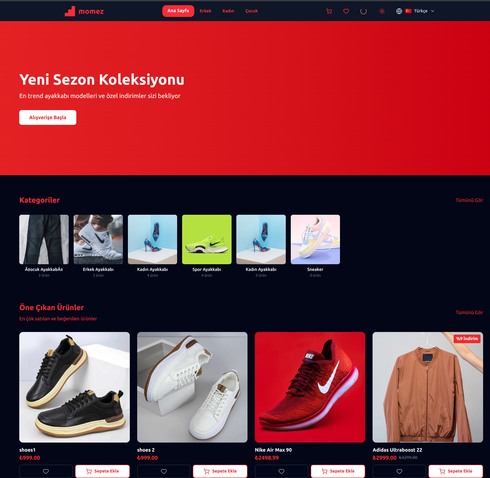
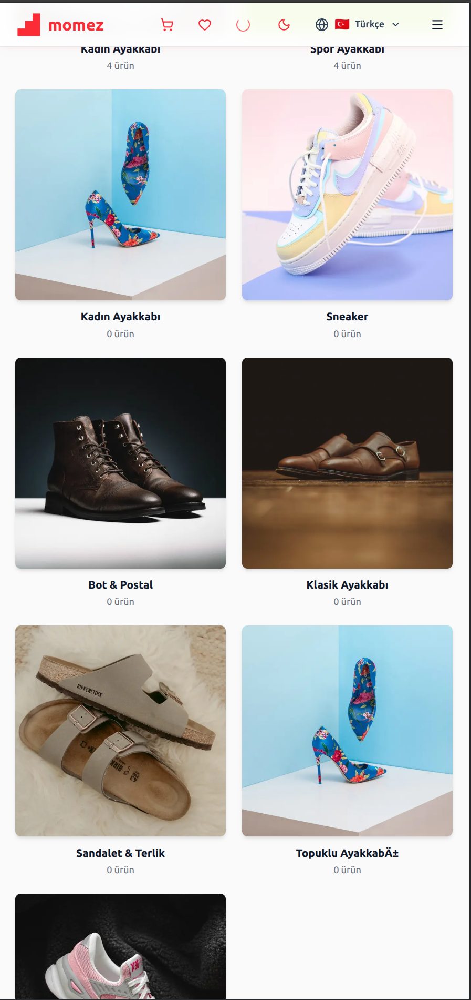
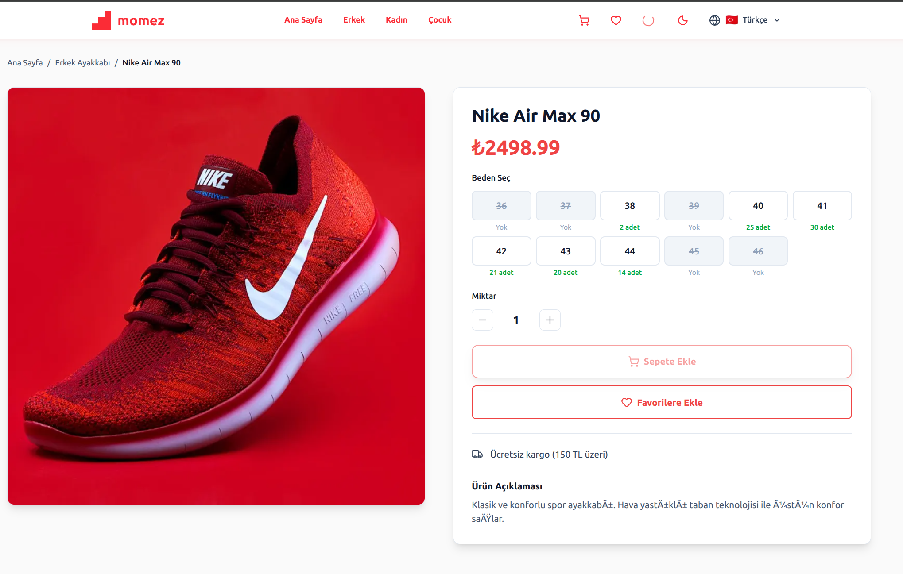
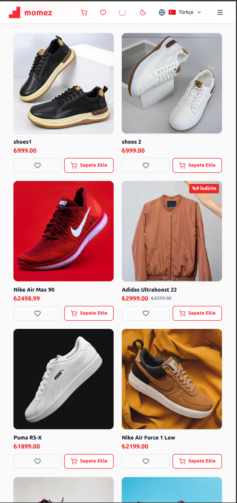
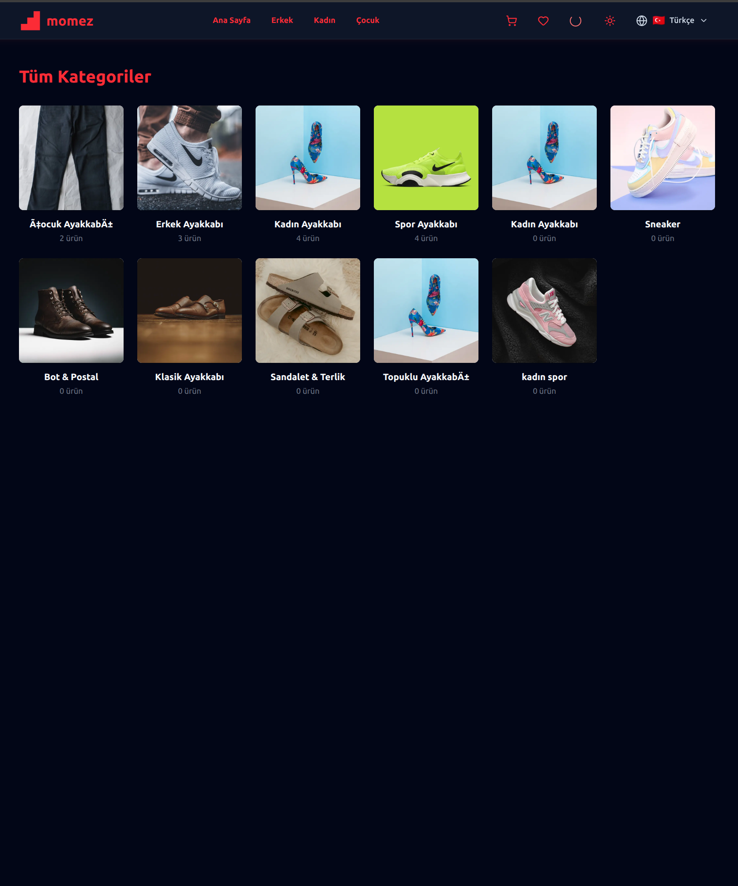
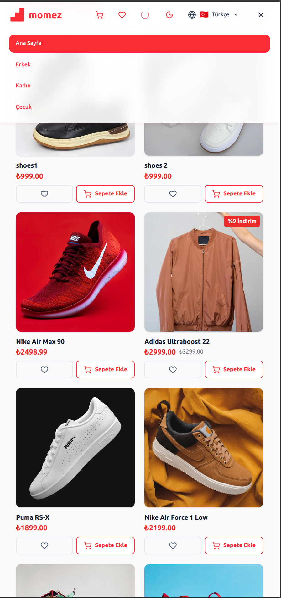
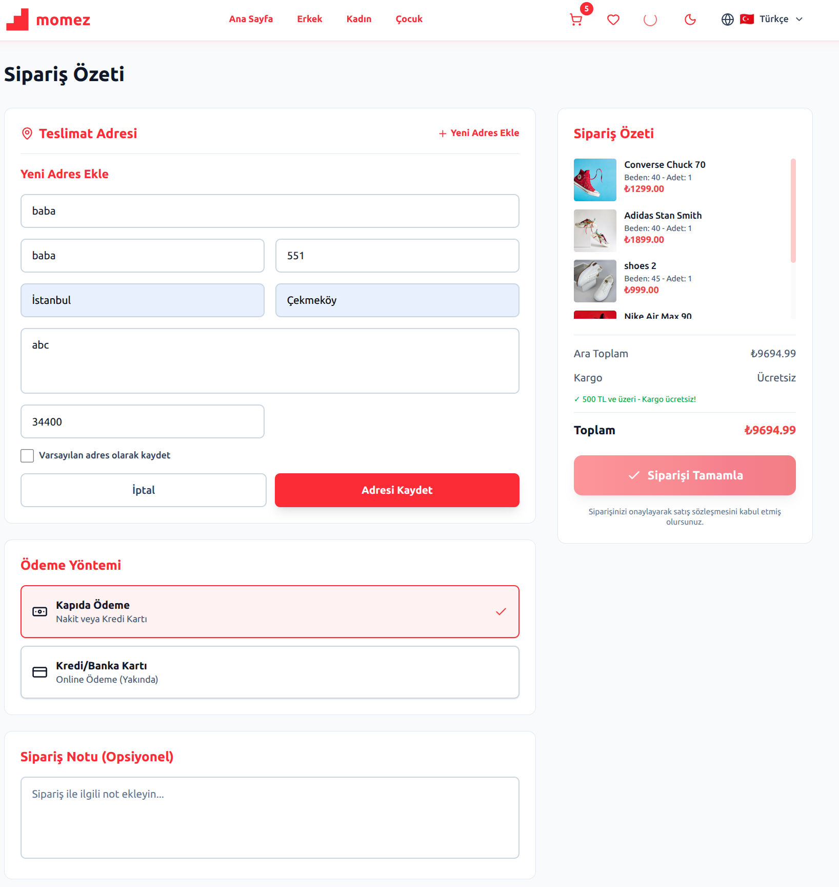
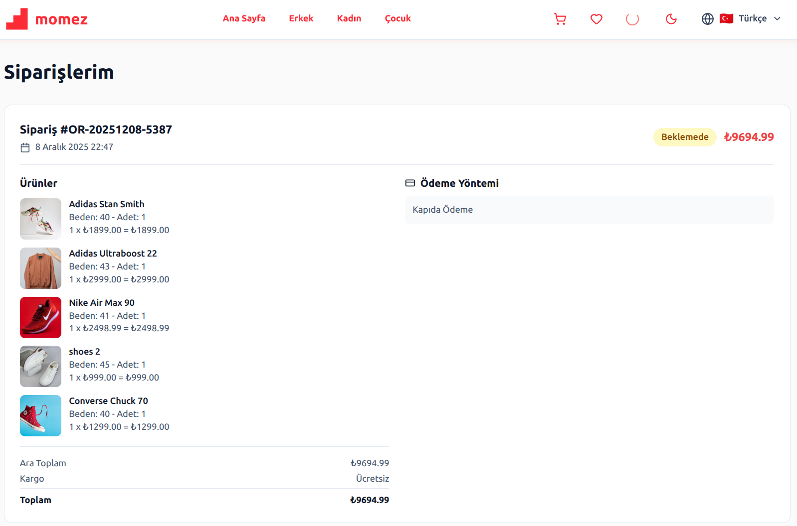

# 👟 momez.co - Premium Shoe E-Commerce Platform

<div align="center">

[](https://momez.co)
[](https://momez.co)
[](LICENSE)

**🌐 Live Website: [momez.co](https://momez.co)**

[🇬🇧 English](#) | [🇹🇷 Türkçe](./README_TR.md)


</div>

---

## 📱 Project Overview

**momez.co** is a fully-featured, production-ready e-commerce platform built from scratch using modern web technologies. This project represents a comprehensive solution for online shoe retail, featuring a sophisticated architecture, intuitive user experience, and robust backend infrastructure.

The platform was designed with scalability, performance, and user experience as core priorities, implementing industry best practices and modern development patterns throughout the entire stack.

### 🎯 Project Vision & Goals

**Primary Objectives:**
- Create a seamless and engaging online shopping experience
- Build a scalable and maintainable codebase architecture
- Implement responsive design across all device categories
- Ensure high performance and optimal loading times
- Maintain security and data integrity standards
- Provide comprehensive product management capabilities

**Target Audience:**
- End consumers looking for quality footwear
- Mobile and desktop shoppers
- Turkish-speaking market (with potential for expansion)

---

## ✨ Key Features & Capabilities

### 🛍️ E-Commerce Functionality

#### Product Management
- **Multi-Category System**: Organized product hierarchy (Men's, Women's, Children's, Sports)
- **Advanced Product Filtering**: Sort by price, category, popularity, and custom attributes
- **Product Search**: Real-time search with intelligent suggestions
- **Inventory Management**: Stock tracking and availability display
- **Image Galleries**: High-quality product photography with zoom capabilities
- **Product Variants**: Size, color, and style variations support

#### Shopping Experience
- **Dynamic Cart System**: Real-time cart updates without page refresh
- **Wishlist Functionality**: Save favorite items for later
- **Special Offers**: Campaign management and discount system
- **Quick View**: Preview products without leaving the current page
- **Related Products**: Intelligent product recommendations

#### Business Features
- **Order Management**: Complete order processing workflow
- **Customer Accounts**: User registration and profile management
- **Order History**: Detailed purchase records for customers
- **Email Notifications**: Automated transactional emails
- **Contact System**: Customer support and inquiry handling

### 🎨 Design & User Experience

#### Visual Design
- **Modern Interface**: Clean, minimalist design language
- **Consistent Branding**: Cohesive visual identity throughout
- **Micro-interactions**: Smooth animations and transitions

#### Responsive Design
- **Mobile-First Approach**: Optimized for smartphones and tablets
- **Adaptive Layouts**: Fluid grid system across breakpoints
- **Touch Optimization**: Mobile-friendly interactions and gestures

---

## 🛠️ Technology Stack & Architecture

<div align="center">

### Frontend Technologies


### Backend & Database


### DevOps & Deployment


</div>

### 🏗️ Architecture Details

#### Frontend Architecture
- **Framework**: Next.js 14+ with App Router (SSR, SSG, ISR)
- **Language**: TypeScript 5+ (Strict type checking)
- **Styling**: Tailwind CSS 3+ (Utility-first CSS)

#### Backend Architecture
- **Runtime**: Node.js 20 LTS
- **API Design**: RESTful Architecture
- **Database**: MySQL 8.0 (Relational database)

#### Database Schema Design
```text
📊 Core Tables:
├── products          (Product catalog)
├── categories        (Category hierarchy)
├── users             (Customer accounts)
├── orders            (Order records)
├── order_items       (Order line items)
├── cart              (Shopping cart)
├── wishlist          (Saved items)
└── reviews           (Product reviews)
``` 
---

## 🎥 Visual Showcase

### 🖥️ Desktop Experience
<table>
  <tr>
    <td width="33%" align="center">
      
      <br>
      <sub><b>Homepage</b><br>Intuitive navigation & featured products</sub>
    </td>
    <td width="33%" align="center">
      
      <br>
      <sub><b>Category Page</b><br>Advanced filtering and sorting</sub>
    </td>
    <td width="33%" align="center">
      
      <br>
      <sub><b>Product Detail</b><br>Visual gallery & purchase options</sub>
    </td>
  </tr>
</table>

### 📱 Mobile Experience
<table>
  <tr>
    <td width="33%" align="center">
      
      <br>
      <sub><b>Mobile Homepage</b><br>Touch-optimized interface</sub>
    </td>
    <td width="33%" align="center">
      
      <br>
      <sub><b>Mobile Category</b><br>Quick filtering & grid view</sub>
    </td>
    <td width="33%" align="center">
      
      <br>
      <sub><b>Mobile Menu</b><br>Intuitive hamburger menu</sub>
    </td>
  </tr>
</table>

### 🚀 Features Showcase
<table>
  <tr>
    <td width="50%" align="center">
      
      <br>
      <sub><b>Shopping Cart</b><br>Real-time updates & calculations</sub>
    </td>
    <td width="50%" align="center">
      
      <br>
      <sub><b>Checkout Process</b><br>Streamlined flow with progress</sub>
    </td>
  </tr>
</table>

---

## 🌐 Live Demo & Testing

### 🔗 Access the Live Platform
> Visit **[momez.co](https://momez.co)** to explore all features in action.

### 🧪 Suggested Testing Flow

| Section | Actions to Test |
| :--- | :--- |
| **1. Homepage** | ✅ View featured products<br>✅ Test nav & footer<br>✅ Check responsiveness |
| **2. Category** | ✅ Browse categories<br>✅ Try filters & sorting<br>✅ Use search functionality |
| **3. Product** | ✅ View details & images<br>✅ Check variations<br>✅ Read descriptions |
| **4. Responsive** | ✅ Mobile (Portrait/Landscape)<br>✅ Tablet & Desktop<br>✅ Cross-browser checks |
| **5. Corporate** | ✅ Review 'About Us'<br>✅ Test Contact Form<br>✅ Check Privacy Policy |

---


## 💡 Development Process & Methodology

### Phase 1: Planning & Research (Week 1-2)
- Market research and competitor analysis
- User persona development
- Technical architecture design

### Phase 2: Design (Week 3-4)
- Visual design and branding
- Responsive mockups
- Design system documentation

### Phase 3: Development (Week 5-10)
- **Frontend**: Component implementation, State management, API integration
- **Backend**: Database setup, API endpoint creation, Authentication

### Phase 4: Testing & Deployment
- Unit & Integration testing
- Docker containerization
- Production environment setup

---

## 🔧 Technical Challenges & Solutions

### Challenge 1: Performance Optimization
**Problem**: Initial load time was slow with large product catalogs.
**Solution**: Implemented code splitting, Lazy loading and Next.js Image optimization.

### Challenge 2: Responsive Design
**Problem**: Complex layouts needed to work across all devices.
**Solution**: Adopted mobile-first design approach and Tailwind grid system.

### Challenge 3: Database Performance
**Problem**: Slow queries with growing product database.
**Solution**: Implemented indexing and connection pooling strategies.

---

## 🏆 Key Achievements

✅ Built a production-ready, scalable e-commerce platform.
✅ Achieved 90+ Lighthouse performance score.
✅ Implemented type-safe development with TypeScript.
✅ Set up containerized deployment with Docker.

---

## 📝 Important Notes

### 🔒 Source Code Privacy
This repository serves as a **showcase and demonstration** of the momez.co project. This public repository contains:
- ✅ Project documentation and overview
- ✅ Technical specifications and architecture
- ✅ Screenshots and visual demonstrations

---

<div align="center">

### ⭐ If you like this project, please give it a star!

**Built with modern web technologies**

[](https://github.com/adalomer)
[](https://www.linkedin.com/in/%C3%B6mer-ali-adal%C4%B1-341148279/)

**© 2025 momez.co - All Rights Reserved**

</div>
